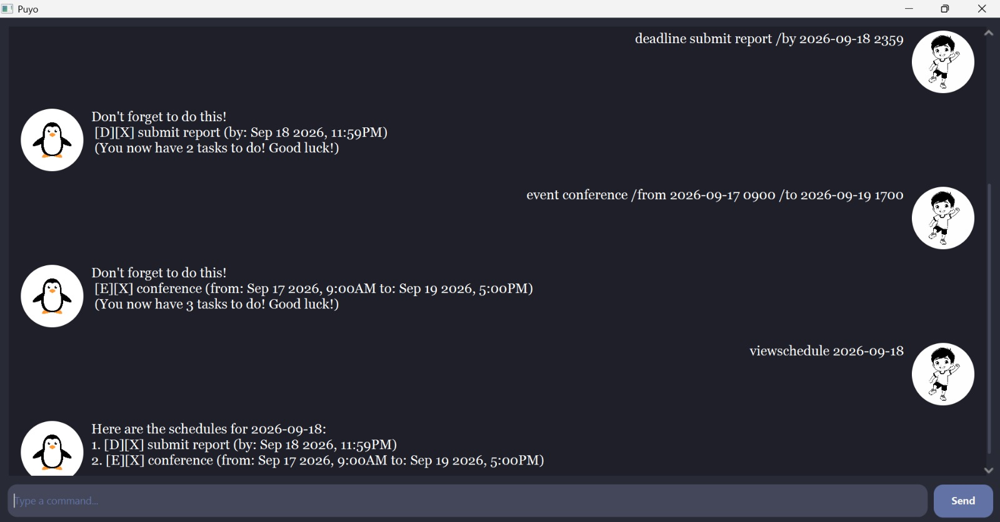

# Puyo User Guide

Puyo is your penguin companion for keeping track of tasks, deadlines, and events. Its desktop chat interface lets you manage your list by typing short commands.



Image credits: the penguin avatar (`puyo.png`) comes from [this source page](https://storage.googleapis.com/dskaigdjhfmhqe/apparel-with-penguin-logo.html). The user avatar (`user.png`) comes from [this black-and-white boy illustration on Magnific](https://www.magnific.com/premium-vector/black-white-boy-illustration-doodle-artwork_176795745.htm).

## Quick start

1. Install **Java 25**. In a terminal, run `java -version` and check that the reported version is 25.
2. Download `puyo.jar` from the [latest Puyo release](https://github.com/fikoww/ip/releases/latest).
3. Move the JAR to a folder where you want to keep Puyo and your tasks.
4. Open a terminal in that folder and run:

   ```bash
   java -jar puyo.jar
   ```

5. When the Puyo window opens, enter a command in the text field. Press Enter or click **Send**.

Try these commands one at a time:

```text
todo read chapter 6
deadline submit report /by 2026-09-18 2359
event study group /from 2026-09-17 1400 /to 2026-09-17 1600
list
```

Puyo confirms each addition. The `list` command displays them alongside any tasks already saved.

## Command basics

- Replace uppercase placeholders such as `DESCRIPTION` with your own text; do not type the placeholder itself.
- Command words and `/by`, `/from`, and `/to` are case-insensitive. For example, `TODO read` and `todo read` both work.
- Dates use `yyyy-MM-dd`, such as `2026-09-18`. A date without a time means **midnight at the start of that day**.
- To include a time, use `yyyy-MM-dd HHmm` with a 24-hour clock: `2026-09-18 1800` means 18 September 2026 at 6 pm. Hours range from `00` to `23`, and minutes from `00` to `59`.
- Supply a real calendar date. For example, `2026-02-30` is invalid. Use a space between the date and time.
- Task numbers start at **1**. Before using `mark`, `unmark`, or `delete`, use the number shown by the full `list` command. Search and schedule results number their own matches separately.

## Adding tasks

### Todo: `todo`

Add a task that does not need a date.

Format: `todo DESCRIPTION`

Example: `todo read chapter 6`

Puyo adds the task as incomplete and shows the task and the new total number of tasks. The description cannot be empty.

### Deadline: `deadline`

Add a task with a due date and optional time.

Format: `deadline DESCRIPTION /by DATE_TIME`

Examples:

```text
deadline submit report /by 2026-09-18 2359
deadline return library book /by 2026-09-20
```

Puyo adds the deadline and displays its due date and time. Use an explicit time such as `2359` if you mean the end of a day; a date alone means `0000`.

### Event: `event`

Add an event with a start and end date/time.

Format: `event DESCRIPTION /from DATE_TIME /to DATE_TIME`

Examples:

```text
event study group /from 2026-09-17 1400 /to 2026-09-17 1600
event workshop /from 2026-09-17 0900 /to 2026-09-19 1700
```

Puyo adds the event and displays its start and end. Supply `/from` before `/to`, and make the start strictly earlier than the end. Two identical dates without times are not a valid event because both mean midnight.

## Viewing and finding tasks

### List all tasks: `list`

Enter `list` to see every task, including completed tasks, in the order added. If the list is empty, Puyo reports that there are no tasks yet.

Task labels use `[T]` for todos, `[D]` for deadlines, and `[E]` for events. `[X]` means incomplete and `[✓]` means completed. For example:

```text
1. [T][X] read chapter 6
```

### Find by description: `find`

Format: `find KEYWORD`

Example: `find report`

Puyo shows tasks whose descriptions contain the search text, ignoring letter case. `find report` matches `Submit REPORT` and `weekly report`. Multiple words are treated as one phrase: `find study group` searches for that phrase. Completed tasks can also match. If nothing matches, Puyo says so.

### View a date's schedule: `viewschedule`

Format: `viewschedule DATE`

Example: `viewschedule 2026-09-18`

Puyo shows deadlines due on that date and events whose date range includes it. Events appear on every date from their start date through their end date, **including both dates**. The end date is included even if the event ends at midnight. Todos do not appear because they have no date. Completed tasks remain visible.

For example, the workshop from 17 to 19 September shown above appears in the schedule for 18 September. If nothing matches, Puyo reports that there are no schedules for the requested date.

## Updating your list

Run `list` first to find the current task number. Deleting a task changes the numbers of tasks after it.

| Action | Format | Example | Result |
| --- | --- | --- | --- |
| Mark completed | `mark NUMBER` | `mark 1` | Marks task 1 as completed and shows a confirmation. |
| Mark incomplete | `unmark NUMBER` | `unmark 1` | Marks task 1 as incomplete and shows a confirmation. |
| Delete | `delete NUMBER` | `delete 1` | Removes task 1 and shows the remaining task count. |

Marking an already completed task or unmarking an already incomplete task leaves it unchanged and shows a message. Deletion has no undo command.

## Exiting: `bye`

Enter `bye` to save the task list and close Puyo after its farewell message.

## Your saved tasks

Puyo stores tasks in `data/puyo.txt`, relative to the folder from which you launched it. It loads the file when it starts and saves after adding, deleting, marking, or unmarking a task, and when you enter `bye`.

If the file does not exist, Puyo starts with an empty list and creates the folder and file when it saves. Launch Puyo from the same folder each time to use the same saved tasks. To move your tasks, close Puyo and copy its `data` folder along with the JAR. Keep a backup of `data/puyo.txt` if you need to protect your list from accidental deletion.

## Troubleshooting and limitations

| Problem | What to do |
| --- | --- |
| Puyo does not recognise a command | Check the command names below. For example, use `todo read`, not `add read`. |
| A description, keyword, date, or task number is missing | Supply all required parts of the command using the formats above. |
| A date or time is rejected | Use a real date in `yyyy-MM-dd` format, optionally followed by a valid four-digit time such as `1800`. |
| An event is rejected | Check that `/from` precedes `/to` and that the start is earlier than the end. |
| A task number is invalid | Run `list` and use a number from 1 to the current total. |
| Tasks appear to be missing after restarting | Launch the JAR from the original folder and check that its `data/puyo.txt` is still present. |
| Puyo reports that it could not save tasks | Check that the launch folder is writable and there is space available. A change shown on screen might not have been saved; retry after resolving the problem. |
| The JAR does not start | Run it from a terminal using `java -jar puyo.jar` so you can see the error, and confirm that `java -version` reports Java 25. |

Puyo allows duplicate tasks. It does not provide reminders, recurring tasks, editing, or undo; to change a description or date, delete the old task and add its replacement. Avoid the sequence ` | ` in descriptions because it is used to separate fields in the save file. Invalid saved lines may be skipped when loading, so avoid manually editing the file and keep a backup.

## Command summary

| Command | Format |
| --- | --- |
| Add a todo | `todo DESCRIPTION` |
| Add a deadline | `deadline DESCRIPTION /by DATE_TIME` |
| Add an event | `event DESCRIPTION /from DATE_TIME /to DATE_TIME` |
| List tasks | `list` |
| Find tasks | `find KEYWORD` |
| View a schedule | `viewschedule DATE` |
| Mark completed | `mark NUMBER` |
| Mark incomplete | `unmark NUMBER` |
| Delete a task | `delete NUMBER` |
| Exit | `bye` |
